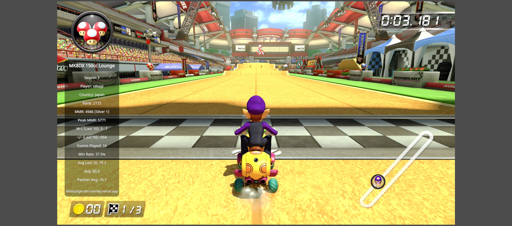

# 8DX-Lounge.OBS-Overlay
OBS等の配信ツールでブラウザソースを利用し、MK8DX 150cc Lounge の Stats を表示する配信者向けのオーバーレイです。配信上でラウンジの戦績をリスナーとリアルタイムで共有できたり、アーカイブ上に記録として残せたら面白いかもしれないという思いで作りました。もちろん、限定公開や録画だけの環境でも活用できると思います。環境によっては、フォントが見づらい等の不具合があるかもしれません。オーバーレイのフォントはデフォルトで [Noto Sans/Regular-400](https://github.com/googlefonts/noto-fonts/blob/main/hinted/ttf/NotoSans/NotoSans-Regular.ttf) を使用しています。(もし見づらかったら、CSS弄ってください。) 本アプリケーションは [Vercel](https://vercel.com/) に デプロイしてありますが、基本的にSSRしているため応答速度が遅い場合があるかもしれません。(CDNキャッシュはある程度設定しています。)

## 使い方
OBSでブラウザソースに https://8dxlounge-obs-overlay.vercel.app/overlay/(ラウンジのプレイヤー名)/(シーズン) を貼り付け、幅300 高さ800 を指定します。

例: https://8dxlounge-obs-overlay.vercel.app/overlay/takagi/5



オーバーレイは、10分毎に自動更新されます。(されないときは再読み込みをしてください。)

### カスタムCSS の使用
基本そのままがいいと思いますが、弄りたくなったら好きなようにいじってください。以下はあくまで例です。[./static/style.css](./static/style.css) をご参照ください。
```css
.overlay {
    font-size: 40px;
}

.title {
    color: red;
}

.items {}

.link {}
```

## 使用している Web API
[https://www.mk8dx-lounge.com/api/](https://www.mk8dx-lounge.com/api/) にて公開されている匿名利用可能な Lounge API を使用しています。

## フィードバック
Twitter 等で連絡してくだされば、できる範囲で対応します。

## LICENCE
iamtakagi/8DX-Lounge.OBS-Overlay is provided under the MIT license.